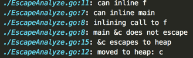

## Go语言中的闭包
----------

先看一个demo：<br/>

```
func f(i int) func() int {
    return func() int {
        i++
        return i
    }
}
```

函数f返回了一个函数，**返回的这个函数就是一个闭包**。这个函数中本身是没有定义变量`i`的，而是引用了它所在的环境（`函数f`）中的变量`i`。<br/>

我们再看一下效果：<br/>

```
c1 := f(0)
c2 := f(0)
c1()    // reference to i, i = 0, return 1
c2()    // reference to another i, i = 0, return 1
```

**c1跟c2引用的是不同的环境**，在调用`i++`时修改的不是同一个`i`，因此两次的输出都是1。*函数f每进入一次，就形成了一个新的环境*，对应的闭包中，函数都是同一个函数，环境却是引用不同的环境。<br/>

变量`i`是函数f中的局部变量，假设这个变量是在函数f的栈中分配的，是不可以的。因为函数f返回以后，对应的栈就失效了，f返回的那个函数中变量i就引用一个失效的位置了。所以***闭包的环境中引用的变量不能够在栈上分配***。<br/>

#### escape analyze<br/>
在继续研究闭包的实现之前，先看一看Go的一个语言特性：<br/>

```
func f() *Cursor {
    var c Cursor
    c.X = 500
    noinline()
    return &c
}
```

Cursor是一个结构体，这种写法在C语言中是不允许的，因为变量c是在栈上分配的，*当函数f返回后c的空间就失效了*。但是，在Go语言规范中有说明，这种写法在Go语言中合法的。语言会自动地识别出这种情况并在堆上分配c的内存，而不是函数f的栈上。<br/>

为了验证这一点，可以观察函数f生成的汇编代码：<br/>

```
MOVQ    $type."".Cursor+0(SB),(SP)    // 取变量c的类型，也就是Cursor
PCDATA    $0,$16
PCDATA    $1,$0
CALL    ,runtime.new(SB)    // 调用new函数，相当于new(Cursor)
PCDATA    $0,$-1
MOVQ    8(SP),AX    // 取c.X的地址放到AX寄存器
MOVQ    $500,(AX)    // 将AX存放的内存地址的值赋为500
MOVQ    AX,"".~r0+24(FP)
ADDQ    $16,SP
```

识别出变量需要在堆上分配，是由编译器的一种叫***escape analyze***的技术实现的。如果输入命令：<br/>

```
go build --gcflags=-m main.go
```

可以看到输出：<br/>

<br/>

注意最后两行，标识c逃逸了，被移动到堆中。escape analyze可以分析出变量的作用范围，这是对垃圾回收很重要的一项技术。<br/>

